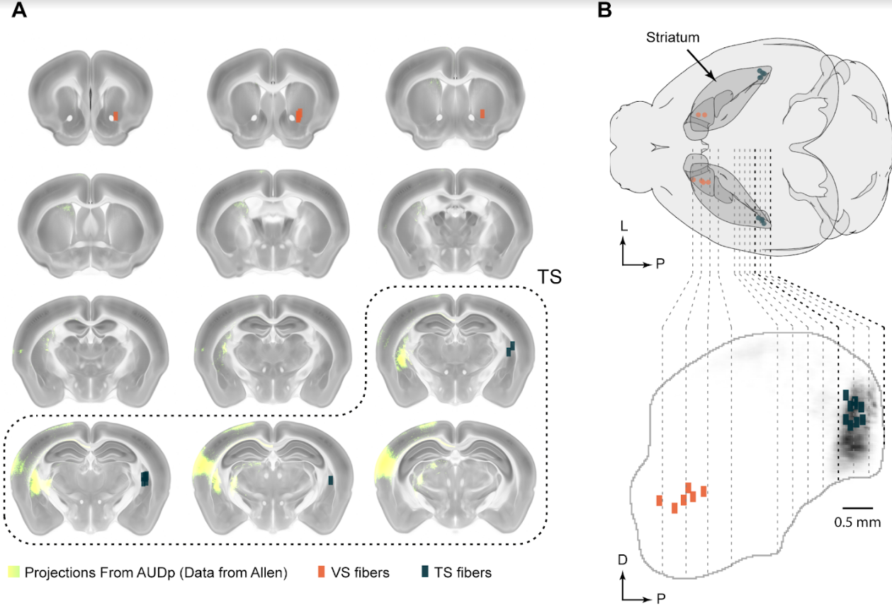

# brain-locations-visualizer

[](https://github.com/HernandoMV/brain-locations-visualizer/actions/workflows/documentation.yaml)

Uses point locations, in 3D coordinates of the Allen Brain Atlas, to create different visualisations for these locations:
<p align="middle">
  
</p>

:books: See documentation [here](https://hernandomv.github.io/brain-locations-visualizer/)

### Installation

Clone this repo

Optional: create a virtual environment

In your terminal, navigate to the folder where you cloned it and run:

```
pip install .
```

Download supporting data (e.g. atlas) from [](https://doi.org/10.5281/zenodo.7501966)

Put it inside the data folder.

### Usage

All the scripts work with a text file that specifies the coordinates of the points you want to display (e.g. tip of a fiber).
This file looks like the one in the example:

```
data/example_locations.txt
```

The coordinates in this example are the pixel locations of the 25um/px Allen Brain Atlas.
You can generate similar files by registering your brain to the atlas (e.g. see [brainreg](https://github.com/brainglobe/brainreg)), and annotating the x, y and z coordinates of the tip of the fiber.

**Important**: edit the main path (```main_path```) variable in the configuration file ```data/example_config.json``` to specify the absolute path to your ```data``` folder. Do the same with the ```locations_file``` variable if you want to use the example locations file.

The scripts use the configuration file to get all the variables and files (e.g. the fiber locations), and that would be the main place for you to customise the figures to your liking. The generated plots would be saved whenever your configuration file is located.

To generate the plots you should provide as argument the path to the configuration file. In your terminal, run the ```generate_all_figures.py``` script. Assuming you are in ```brain_locations_visualizer``` folder, run:

```
python generate_all_figures.py path/to/your/config/file.json
```

To generate the plots for the example data, run:

```
python generate_all_figures.py
```

Which will automatically use the configuration file in ```data/example_config.json```.
This script will generate all the plots in the ```data``` folder.